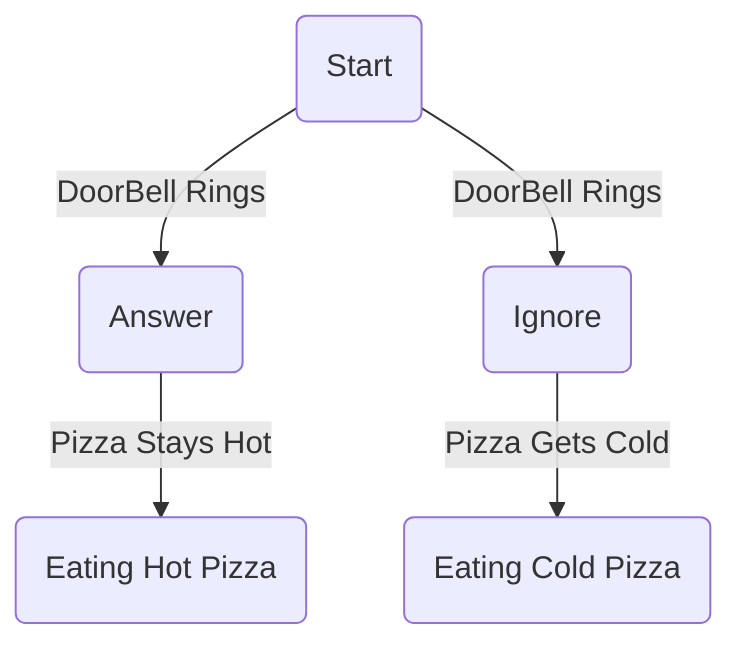

*A* Start
*B* Answering the Ringing Doorbell
*C* Ignore the Ringing Doorbell
*D* Eating Cold Pizza
*E* Eating Hot Pizza
This Flowchart is supposed to be an example of a choose your own adventure. Two paths both originating from the start and from a doorbell ringing. 